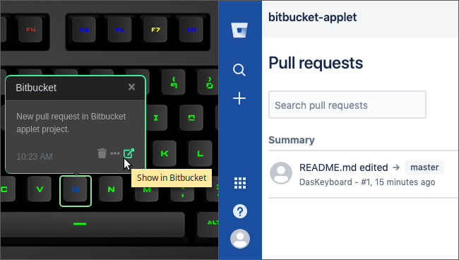

# Bitbucket

Displays Bitbucket public projects activities (updates, pull requests) on a Das Keyboard Q Series.

Bitbucket is our Git repository management solution designed for professional teams.
It gives you a central place to manage git repositories, collaborate on your source code.

For more information about Bitbucket visit <https://www.bitbucket.com>.

This applet uses Bitbucket [API](https://developer.atlassian.com/bitbucket/api/2/reference/).